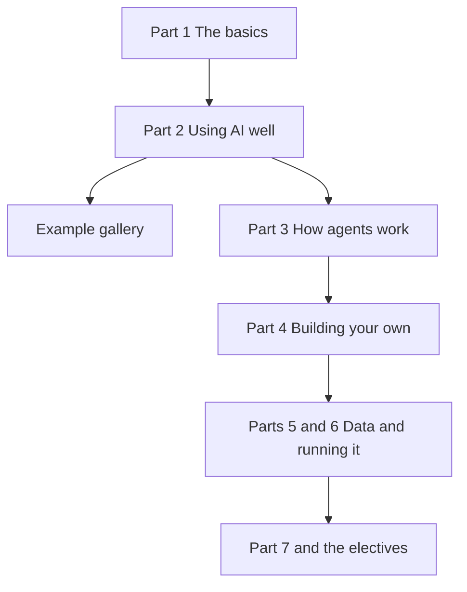

Welcome. This is a plain-language guide to AI and agents, from what a chat assistant actually is to building agents that work on real data. Read it top to bottom, or pick the path below that fits what you want.

**In one line:** start with Part 1 whatever your goal, then follow the reading path that matches how far you want to go.

## Who it is for

Anyone curious about AI. You do not need to code for Parts 1 to 3, which cover what AI is, how to use it well and how agents work. Building starts in Part 4, and each technical step is explained as it comes.

Examples follow three fictional cases: Sample Ventures, a small venture capital fund; Bramley's, a two-person bakery run by its owner Sam; and Jo, a freelance researcher who also takes a part-time course.

## How each page works

Every idea comes in plain words first, then its proper name, so the vocabulary builds as you go. Most pages share the same sections: a one-line definition, a jargon box listing the proper terms the page covers (with a button to show what each means), why it matters, how it works, a worked example, and costs and limits.

One picture runs through the guide: the model is the engine, and everything built around it is the rest of the car.

To see the whole guide at once, open the [concept map](/concept-map/). It shows every page in reading order, what each one builds on and leads to, and where each piece of jargon comes up.

Prefer a picture? Explore the whole idea as a car you can zoom into: [The agentic car](/car-model/).

## Pick a reading path

<mark>Part 1 is for everyone, because it gives you the words every later page is built on.</mark>

| Path | Read | Then |
| --- | --- | --- |
| Just using AI | Part 1 Start here and Part 2 Using AI well | The [example gallery](/agents/example-gallery/), to see what agents can do |
| Building with it | Parts 1 to 4, up to your first agent | Part 5 Data and the context layer, and Part 6 Running it for real |
| Going deep | Everything in order | Part 7 Under the hood, and the electives on the infrastructure map, model makers and chat channels |

Stop wherever your path ends. You can always come back for the next part.

## Places to dip into

- [Glossary](/reference/glossary/): every term in the guide, one line each, with a link to its page
- [One question through every layer](/map/one-question-through-every-layer/): the big picture, following a single question from a person's screen to the model and back

## Next up

Every chat assistant and agent runs on the same kind of engine. [What an LLM is](/start/what-an-llm-is/) explains what that engine actually does.
