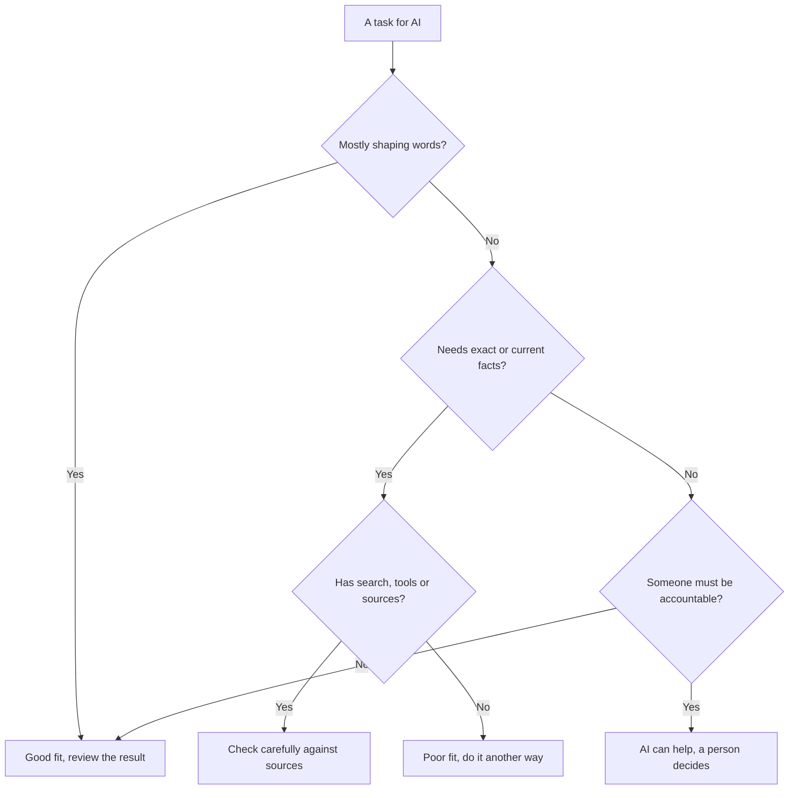

A model that sometimes states false things with confidence is still very useful, as long as you give it the right jobs. This page sorts everyday tasks into good fits, ones to check carefully and poor fits, so you know what to expect before you start.

**In one line:** AI assistants are strong at working with words and patterns, weak at exact facts and figures they have not been given, and should never be the one accountable for a decision.

## The jargon: concepts covered on this page

- **Extraction:** pulling specific details, such as names, dates or amounts, out of text
- **Jagged frontier:** the uneven shape of AI ability, strong at some hard tasks and weak at some easy ones
- **Knowledge cutoff:** the date the model's training text stops, after which it knows nothing unless given sources
- **Non-determinism:** getting different outputs from the same input on different runs

## Why it matters

Most disappointment with AI comes from mismatched expectations. Some people ask it for things it does badly, get a wrong answer, and give up. Others trust it with everything and get caught out by a confident mistake.

A rough sense of where it is strong and where it is weak saves time in both directions. You use it more for the jobs it does well, and you build in a check for the ones it does not.

## How it works

The strengths and weaknesses follow from what a [large language model](/start/what-an-llm-is/) is: a program that predicts plausible text. Anything that is mostly about shaping language plays to that. Anything that needs an exact, current or verified answer works against it.

**Good at.** Drafting a first version of an email, report or post. Summarising a long document. Rewriting text for a different reader or tone. Explaining an idea in simpler words. Pulling specific details out of messy text, such as dates, names and amounts (called **extraction**). Brainstorming options. Writing and explaining computer code.

**Weak or risky at.**

- **Exact arithmetic without tools.** The model predicts digits rather than calculating them, so long sums can come out slightly wrong.
- **Recent facts without search.** It only knows what was in its training text, which stops at a date called the **knowledge cutoff**.
- **Citations without sources.** Asked for references from memory, it can invent ones that look real, a form of [hallucination](/start/hallucination-and-grounding/).
- **Consistent judgement across runs.** Ask the same question twice and you may get two different verdicts, because each reply is generated afresh. This is called **non-determinism**.
- **Anything that needs accountability.** A model cannot take responsibility for a hiring decision, a medical call or a signed contract. A person has to.

**Jagged abilities.** These strengths are uneven in a way that surprises people. A model can explain a hard legal idea well and then miscount the words in a sentence. Researchers call this the **jagged frontier**: ability does not rise smoothly with difficulty, so you cannot assume that doing one hard thing well means it will do an easier neighbouring thing well.

**Tools change the picture.** Many assistants can now use [tools](/agents/tool-use/) (other software the model can call, covered in Part 3). With a calculator or code runner, arithmetic becomes reliable. With web search, recent facts come within reach. With your files connected, it can cite real sources. The model is the same engine; the tools are the extra controls that cover its blind spots.

## In practice

A simple way to sort any task:

| Good fit | Check carefully | Poor fit |
| --- | --- | --- |
| First drafts of emails, posts and reports | Summaries of documents you will act on | Exact figures from memory, with no source |
| Rewriting for tone or a different reader | Facts and figures, even with search on | Recent news, with search turned off |
| Explaining an idea in plain words | Data extracted from long or messy files | Reference lists produced from memory |
| Brainstorming names, angles and questions | Code that will run on real data | Final decisions about people, money or health |
| Turning notes into a tidy structure | Calculations, unless a tool did them | Anything where nobody will check the output |

<mark>Use AI freely for the first draft, and put a person on the final check.</mark>

"Check carefully" does not mean avoid. It means the output is a strong starting point that needs a human eye on the parts that matter, such as numbers, names and anything that will be sent to someone else.

## Worked example

**Bramley's.** Sam, who runs the bakery, asks an assistant to write the description for a new seasonal loaf and three versions of an Instagram caption. That is a good fit: the result needs a quick read, nothing more. Sam then asks it to work out the cost per loaf from a list of ingredient prices. With a code tool switched on, it runs the sums properly. Without one, Sam checks the total on a calculator.

**Jo.** Jo, the freelance researcher, asks for a summary of a 40-page report for a client. That goes in "check carefully": the summary is useful, but Jo spot-checks the key claims against the report itself. When the assistant offers five academic papers to cite from memory, Jo treats them as a poor fit and searches for each one before using it, since one may not exist.

**Sample Ventures.** At the fictional fund, an analyst asks an assistant to compare two startups' pitch decks and list the open questions. That is a good fit. Asking it whether to invest in Acme Payments is not: the assistant can lay out the arguments, but the partners make the call and answer for it.

## Costs and limits

- **The lines move.** Each new generation of models improves on some weak spots, so a task that was a poor fit last year may be a check-carefully task now. Test it again from time to time.
- **Fluency hides errors.** Good writing makes wrong content harder to spot, which is why the "check carefully" column matters.
- **Checking takes time.** If checking a result takes longer than doing the task yourself, AI is not saving you anything on that task.
- **Your setup matters.** The same model can be a poor fit without search and a good fit with it. Know which tools your assistant has switched on.

## Often confused with

**Weak at a task vs refusing a task.** A weakness means the model tries and may get it wrong. A refusal means the provider has trained it to decline certain requests, which is a policy choice, not a lack of ability.

## Related

- [Hallucination and grounding](/start/hallucination-and-grounding/): why confident mistakes happen and how sources reduce them
- [Tool use](/agents/tool-use/): how calculators, search and files cover a model's blind spots
- [Reasoning models](/using-ai/reasoning-models/): models that think step by step, which helps on harder problems
- [Human in the loop](/agents/human-in-the-loop/): keeping a person on the decisions that matter

## Next up

Knowing what AI does well leads straight to the practical question of which assistant to try first. [Which AI should I use?](/start/which-ai-should-i-use/) sets out the main options and the questions that actually decide it.
