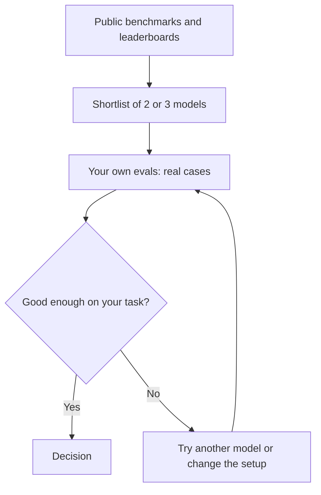

Once models are built, run, labelled, shared and shrunk, the last question is how to compare them, and public benchmarks are where most comparisons start.

**In one line:** a benchmark is a public, standard test that many models take, so their scores can be compared, useful for building a shortlist but not for making the final choice.

## The jargon: concepts covered on this page

- **Benchmark:** a public standard test used to compare models in general
- **Leaderboard:** a ranked table of model scores on one or more benchmarks
- **Contamination:** test material leaking into a model's training data and inflating its score
- **Saturation:** when top models score near the maximum and the test stops separating them
- **Human preference arena:** a ranking built from people voting between anonymous model answers
- **Shortlist:** the small set of candidate models chosen for your own testing

## Why it matters

New models arrive constantly, each announced with charts showing it beating the others. You need some way to tell which are worth a look.

Benchmarks give that: the same questions, put to every model, with a score at the end. They are a fair first filter. They are a poor judge of how a model will do on your work.

<mark>A benchmark tells you which models to try, never which one to pick.</mark>

## How it works

A benchmark is a fixed set of tasks with known right answers, or a fixed way of judging answers. Each model attempts it and gets a score. Benchmarks usually target one skill: general knowledge, maths, coding, reasoning, or completing multi-step tasks as an agent.

A **leaderboard** is a ranked table of benchmark results. Some leaderboards are run by the model's maker, some by independent groups.

A different kind is the **human preference arena**. People are shown answers from two anonymous models to the same question and vote for the better one. Votes are turned into a ranking. This measures what people like, which is useful, but not the same as what is correct.

**How to read a score.** Ask four things: what exactly was tested, who ran it, under what conditions (how many attempts, which instructions, whether tools were allowed), and how big the gap is between the models you are comparing.

**Where scores mislead:**

- **Contamination.** If the test questions leaked into the model's training material, the model may have effectively seen the answers. Researchers describe this as benchmark data contamination, and it inflates scores.
- **Saturation.** Once the best models all score near the maximum, the test can no longer tell them apart.
- **Tuning to the test.** A model can be improved specifically to do well on known benchmarks without being better in general.
- **Narrow tasks.** A benchmark of school-style questions says little about reading messy emails.
- **Different conditions.** Two results are not comparable if one allowed several tries, extra tools or a longer thinking budget, and the other did not.
- **Vendor-run results.** A maker has reasons to show its model well. Independent results carry more weight.
- **Small gaps are noise.** A difference of a point or two may vanish on a rerun or another sample of questions.

## In practice

**Snapshot, as of October 2026.** Benchmarks come and go, and this paragraph will date. MMLU, introduced in a 2020 research paper, tests knowledge and problem solving across 57 subjects, such as history, law and maths. SWE-bench measures whether a model can resolve real software issues taken from open source projects on GitHub, and has several variants. Chatbot Arena, described in a 2024 research paper, ranks models using crowdsourced pairwise human votes. These are examples of three categories: knowledge, agentic coding and human preference. No scores are given here because they change with every release. New benchmarks are constantly created because older ones saturate.

When a vendor announces a model, look for the benchmark names, the conditions and whether anyone independent has reproduced the result. Use all of it to decide what to try, not what to buy.

## Worked example

Sample Ventures, the fictional fund, wants a model to extract fields (company name, founder names, the ask, the sector) from introduction emails and file them in the CRM. Two candidate models look close on public leaderboards, with the newer one slightly ahead on a reasoning benchmark.

The operations lead builds a quick test instead of relying on that:

1. **Collect 25 real introduction emails**, removing anything private and using invented replacements where needed. Include messy ones: forwarded chains, emails with several companies, one in another language.
2. **Write the correct fields by hand** for each email. This is the answer key.
3. **Run both models** with the same instructions.
4. **Score them** field by field: correct, wrong or missing.
5. **Read the failures,** not just the totals.

The result: the leaderboard leader gets 22 of 25 right but sometimes mixes up the sender and the startup's founder in forwarded chains. The other gets 21 of 25 but is cheaper and never confuses the people. With only 25 emails, one point is a weak signal, so she adds 25 more before choosing. The public benchmark helped build the shortlist. The decision came from the firm's own emails (see [evals](/running/evals/)).

## Costs and limits

- **Scores are cheap, relevance is not.** Reading a leaderboard is free. Knowing whether it applies to you takes testing.
- **Moving target.** Rankings change with each release, and benchmarks lose value as models master them.
- **No test covers your data.** Your documents, formats and risks are specific to you.
- **Cost and speed are missing.** A top score may come from a slower or pricier model. Look at those too (see [model routing](/running/model-routing/)).
- **Common mistakes.** Treating a small gap as meaningful, comparing results run under different conditions, trusting only the maker's numbers, and skipping your own test.

## Often confused with

**Benchmark vs eval.** A benchmark is a public test used to compare models in general. An eval is a test you build around your own tasks and data. Benchmarks help you shortlist. Your evals decide (see [evals](/running/evals/)).

## Related

- [Evals](/running/evals/): your own tests, which make the final call
- [Reasoning models](/using-ai/reasoning-models/): a type of model that benchmarks often target
- [Hallucination and grounding](/start/hallucination-and-grounding/): why a high score does not mean reliable answers
- [Model routing](/running/model-routing/): matching models to tasks once you know how they perform

## Next up

That closes the main path of the guide. If you want to keep going, the electives start with [the map of the industry](/map/), which shows who makes what across the AI landscape.
