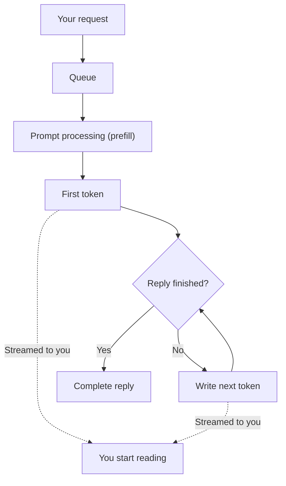

A trained model is an engine on a workbench until someone runs it. Inference is that running: what happens, step by step, each time a model reads a prompt and writes a reply.

**In one line:** inference is the model doing its job, reading your prompt and writing a reply one token at a time, as opposed to training, which is how the model was built in the first place.

## The jargon: concepts covered on this page

- **Decode:** the stage where the model writes its reply one token at a time
- **GPU:** a chip built for large amounts of parallel arithmetic, used to run models
- **Inference:** using a trained model to produce output from a prompt
- **Prefill:** the stage where the model reads and processes the whole prompt
- **Streaming:** sending the reply to you piece by piece as it is produced
- **Time to first token:** the wait between sending a prompt and the first piece of reply
- **Tokens per second:** how fast the model generates its reply once it has started

## Why it matters

Training happens once, at the provider, and you never see it. Inference happens every time anyone sends a request, and it is the part you wait for and pay for.

Understanding it explains several everyday puzzles. Why does a reply start after a pause and then flow? Why does a long document slow things down? Why does a longer answer cost more? Why do providers care so much about small models and caching?

It also tells you where your options are when something is too slow or too expensive: you can change the model, the prompt, or where it runs.

<mark>A model writes its reply one token at a time, and each new token needs the whole conversation so far, which is why long prompts and long answers both cost time and money.</mark>

## How it works

A [token](/start/tokens-and-context-windows/) is a small piece of text, often part of a word. A [language model](/start/what-an-llm-is/) predicts one token at a time, from everything that came before.

Think of a clerk who must read your whole file before writing anything, and who then writes the reply one word at a time, glancing back at the file and at what has been written so far before each word.

A request goes through these stages:

1. **Arrives and waits.** Providers handle many users at once. Your request may wait briefly in a queue until there is room on a machine.
2. **Prompt processing.** The model reads the entire prompt: your question, any instructions and any documents. This stage is often called **prefill**. All of the prompt is available at once, so it can be processed in parallel, which suits the chips well.
3. **First token.** The model produces the first piece of its reply. The wait until this point is the **time to first token**.
4. **Token-by-token loop.** Each new token depends on all the ones before it, so they must be produced in order. This stage is often called **decode**. Each pass reuses saved working from earlier steps (a **cache** of what was already computed for the earlier text), so the model does not redo the whole job each time.
5. **Streaming.** Tokens are sent to you as they are produced, so you can start reading before the reply is complete.

**Latency in plain words.** Two numbers matter most:

- **Time to first token:** how long before anything appears. It grows with the length of the prompt, because the whole prompt must be read first.
- **Speed of generation:** how quickly the rest arrives once it starts, often measured in tokens per second. A longer reply simply takes longer, because there are more steps.

Total waiting time is roughly the first number plus the length of the reply divided by the second.

**Why it needs special hardware.** A model holds billions of numbers, and each token involves a very large amount of arithmetic on them. Graphics processors (GPUs) and similar AI chips are built to do enormous amounts of arithmetic in parallel, and to move big blocks of data quickly. Ordinary office computers are far too slow for large models.

**Batching.** Reading a model's numbers from memory is a big part of the work. Providers process many users' requests together so that one pass over the model serves several people at once. This is a large reason why using a provider's shared service is cheaper than running your own machine for one person.

## In practice

Inference runs in one of three places:

- **A provider's servers, through an API.** You send text and get text back. The provider owns the chips. Examples are the main model labs' own APIs.
- **A cloud platform.** The big cloud companies host models from several labs inside your existing cloud account, which can simplify billing and data controls.
- **Your own hardware.** Common with [open-weight models](/under-the-hood/open-vs-closed-weights/) (models whose learned numbers anyone can download and run). You own the chips and the upkeep, and you keep the data in-house.

Cost normally follows tokens: you pay for what goes in and what comes out. See [how AI pricing works](/running/how-api-pricing-works/).

**Ways to make inference faster or cheaper:**

- **A smaller model.** Fewer numbers to work through. See [model routing](/running/model-routing/) for sending easy jobs to small models.
- **A shorter prompt.** Less to read before the first token, and fewer tokens to pay for.
- **Caching.** Reusing work for a prompt beginning that has been seen before. See [prompt caching and batch processing](/running/prompt-caching-and-batch-processing/).
- **[Quantisation](/under-the-hood/quantisation/).** Storing the model's numbers with less precision, so it needs less memory and runs faster, at a small possible cost in quality.
- **Batching.** Grouping requests, which providers do for you. Some offer cheaper, slower batch services for work that is not urgent.

Reasoning models spend extra tokens thinking before they answer, so they are slower and cost more per answer. See [reasoning models](/using-ai/reasoning-models/).

## Worked example

An associate at Sample Ventures, the fictional fund, pastes a long Acme Payments information memo (dozens of pages) into an assistant and asks: "Summarise the main risks and list every number that conflicts with the deck."

1. **Request sent.** The prompt is the memo plus the question. It is very long in tokens.
2. **Queue.** The request waits briefly for a free machine.
3. **Prompt processing.** The model reads all of it before writing anything. This is the pause the associate notices. A longer memo means a longer pause.
4. **First token appears.** The reply starts streaming.
5. **Token-by-token.** The answer is long, since it lists risks and numbers, so it keeps generating for a while. Each token also has to take the whole memo into account.
6. **Done.** The associate had been reading since step 4, so the stream shortened the felt wait.

If this is slow every day, the options are: send only the relevant sections instead of the whole memo (see [RAG and chunking](/data/rag-and-chunking/)), ask for a shorter format, use a smaller model for a first pass, or use caching if the same memo is queried repeatedly.

## Costs and limits

- **Cost rises with length.** A long prompt and a long answer both mean more tokens. Long conversations that keep resending their history cost more each turn.
- **Speed varies.** The same request can take longer at busy times, because of queueing and shared machines.
- **Bigger models are slower.** They are usually more capable, but each token takes more work.
- **Streaming hides delay, not cost.** It makes waiting feel shorter, but the total work is the same.
- **Your own hardware has overheads.** Chips are expensive, need maintaining, and sit idle when nobody is asking. Self-hosting rarely pays off at small volumes.
- **Common mistake.** Pasting in entire documents "just in case". That slows every request and pays for text the model did not need.

## Often confused with

**Inference vs training.** Training builds or adjusts the model's numbers and happens rarely. Inference only uses them and happens on every request. During inference the model does not learn from your conversation.

## Related

- [What an LLM is](/start/what-an-llm-is/): the token-by-token prediction that inference carries out
- [Tokens and context windows](/start/tokens-and-context-windows/): what is being counted, and how much fits
- [Quantisation](/under-the-hood/quantisation/): one way to run a model faster and on smaller hardware
- [How AI pricing works](/running/how-api-pricing-works/): how inference turns into a bill
- [Machine learning and neural networks](/under-the-hood/machine-learning-and-neural-networks/): the learning idea behind a trained model

## Next up

A language model is one example of a wider idea, software that learns from examples. [Machine learning and neural networks](/under-the-hood/machine-learning-and-neural-networks/) steps back to show how that learning works, whether the examples are text or the rows of a spreadsheet.
