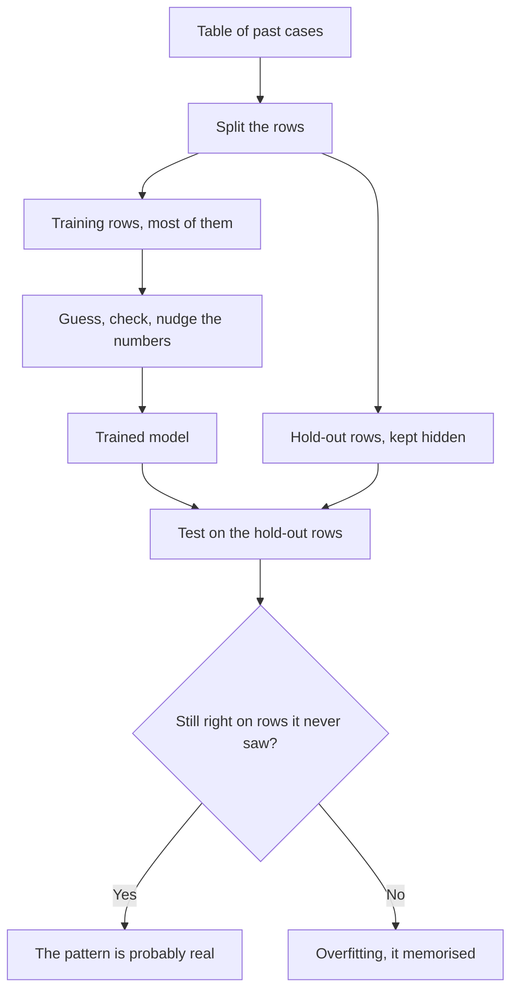

A language model is one example of a wider idea: software that learns from examples. After [inference](/under-the-hood/inference/) showed what a trained model does when it runs, this page steps back to that wider idea, and to the neural network design inside most modern models.

**In one line:** machine learning is software that works out its own rules from examples, and a neural network is the most common design for doing it, whether the examples are text, images or the rows of a spreadsheet.

## The jargon: concepts covered on this page

- **Black box:** a model whose answers you can see but whose reasoning you cannot
- **Deep learning:** machine learning that uses neural networks with many layers
- **Hold-out data:** examples kept back from training and used afterwards as an exam
- **Interpretability:** methods for working out why a model gives the answers it does
- **Machine learning:** software that learns patterns from examples instead of being given rules
- **Neural network:** a model built from many layers of simple maths units, with internal numbers that are adjusted during training
- **Overfitting:** a model memorising its training examples, so it fails on new ones
- **Tabular data:** data in rows and columns, like a spreadsheet
- **Target variable:** the column you want a model to predict or explain

## Why it matters

Some problems are too messy to write rules for. Nobody can list every rule for spotting a spam email, or for working out which customers will cancel. Showing a program thousands of past cases and letting it find the rules itself works far better.

The same idea sits behind many tools you will meet. A language model learned from text. Other models learn from images, sound or the numbers in a table. The training idea is the same each time, so once you see it, the labels on the following pages are easier to read.

## How it works

Take a table. Each row is one case, such as one day at a bakery. Each column is a fact about it. One column is the outcome you care about, called the **target variable**.

A **neural network** starts with random internal numbers, so its first guesses are poor. It guesses the outcome for a row, checks the real answer, and nudges its numbers to be a little less wrong. Repeat that across thousands of rows, many times over, and the guesses get better. That loop is [training](/start/what-an-llm-is/), and the internal numbers it adjusts are the [parameters](/under-the-hood/parameters-and-temperature/) you met earlier.

Two ideas make the result trustworthy.

The first is **hold-out data**. <mark>A model that scores well on rows it has already seen proves little: the real test is rows it has never seen.</mark> Setting some rows aside before training, and scoring the model on them afterwards, is the standard way to check.

The second is **overfitting**. A model with enough internal numbers can memorise the training rows, like a student who learns last year's answers word for word. It looks brilliant until the questions change. The hold-out exam catches this.

A neural network with many layers is called **deep learning**. "Deep" only refers to the number of layers. Large language models are deep neural networks, which makes them one kind of machine learning.

### The engine and the car

In the car metaphor, the model is the engine. Machine learning is the idea that an engine can be tuned on a test track instead of being designed line by line. A neural network is one popular engine design, training is the tuning, and hold-out data is a road the engine never practised on.

Most neural networks are sealed engines. You can drive them and watch the speedometer, but you cannot see why they behave as they do. That is the **black box** problem. **Interpretability** is the diagnostic laptop you plug in to read what is going on inside.

## In practice

A small neural network trained on a table is very different from a large language model, though the idea is shared. A language model has billions of parameters and learned from huge amounts of text. A model for a table might have thousands of parameters and learn from a few thousand rows, on a laptop, in minutes.

You will meet both kinds. Some tools that search a dataset for patterns train a model on your table and then use interpretability methods to report what it found. Tools that write and chat use a language model. Some products combine the two, such as an agent that calls a pattern-finding tool and explains the results in plain English (agents are covered in Part 3).

Interpretability is a young and active research area. It gives clues about what a model has learned, not proof, and the methods are still being tested and argued over.

## Worked example

Sam runs Bramley's, a fictional two-person bakery. Sam keeps a spreadsheet with one row per day for 600 days: the weather, the day of the week, whether a school holiday was on, whether there was a local event, and whether the rye loaves sold out.

Sam trains a model to predict "sold out" from the other columns. To keep it honest, 500 days go into training and 100 are held back.

The first model scores 99 percent on the 500 training days but only 60 percent on the 100 held-out days. That gap is overfitting: it memorised those 500 days. (These numbers are made up to show the idea.)

A simpler model scores 78 percent on training and 76 percent on the held-out days. The two scores are close, so the pattern it found is more likely to be real.

Now interpretability helps. Looking inside the second model suggests that rye mostly sells out on rainy Saturdays during school holidays. Neither rain nor holidays does much alone. The effect only shows when they combine, which Sam would never have thought to test.

## Costs and limits

- **It needs enough examples.** A few dozen rows will not teach a model anything reliable.
- **It learns whatever is in the table.** Mistakes and gaps in the data end up in the model too.
- **Patterns are not causes.** Finding that rain and sell-outs go together does not show that rain causes them.
- **Simpler methods can win.** Research on medium-sized tables has found that tree-based methods, a different family of models, often match or beat neural networks, so a neural network is not automatically the best tool.
- **Looking inside is hard.** Interpretability methods give clues, and different methods can sometimes point to different explanations.
- **Searching finds fluke patterns.** The more patterns you search through, the more some will look real by chance, so good tools test for this.

## Often confused with

**Neural network vs the brain.** The name is borrowed from the brain, but a neural network is maths running on a computer. It does not think or understand.

**Machine learning vs AI.** AI is the broad goal of machines doing tasks that seem intelligent. Machine learning is one way of getting there, and deep learning is a branch of it.

**Machine learning vs a language model.** A language model is one kind of machine learning model, trained on text. Machine learning also covers models trained on tables, images and sensors.

## Related

- [What an LLM is](/start/what-an-llm-is/): the best-known neural network, trained on text
- [Parameters and temperature](/under-the-hood/parameters-and-temperature/): the internal numbers that training adjusts
- [Pre-training and post-training](/under-the-hood/pre-training-and-post-training/): how a very large network is trained at scale
- [LLMs, LRMs and LQMs](/under-the-hood/llms-lrms-and-lqms/): models built around numbers and simulation rather than text
- [Specialised models](/map/specialised-models/): neural networks trained to produce one kind of output

## Next up

Now that you know what a neural network is, the labels attached to models are easier to read. [LLMs, LRMs and LQMs](/under-the-hood/llms-lrms-and-lqms/) sorts out what each label means and why the more useful question is what a model is built to do.
