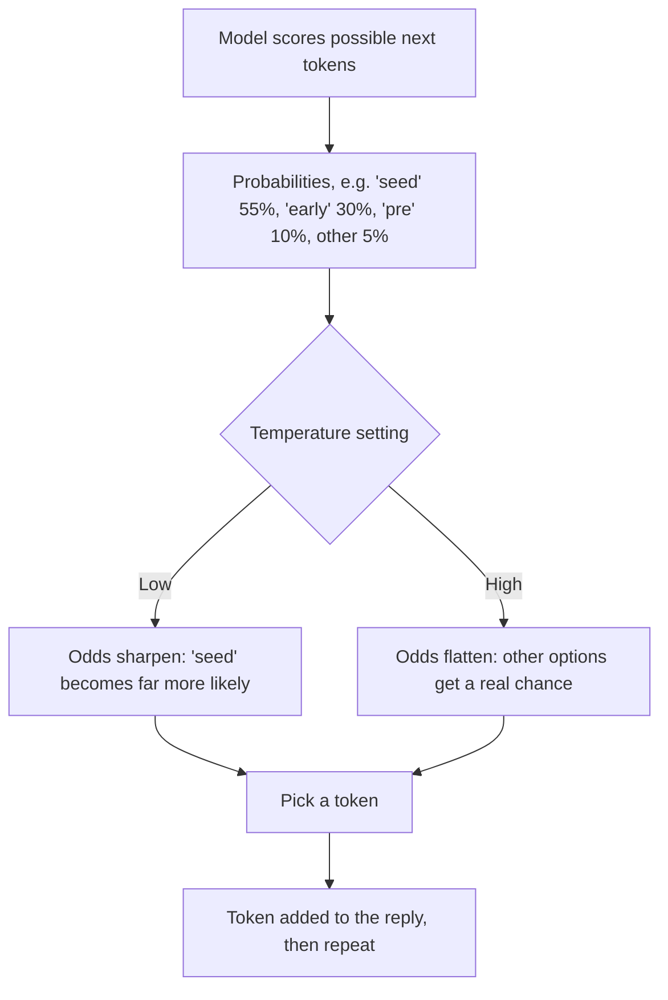

Training gives a model its knowledge and habits, stored as an enormous set of numbers. This page covers those numbers, and temperature, the main dial you can turn each time you use the model.

**In one line:** parameters are the learned numbers inside a model that make up its size, while temperature is a setting you can sometimes change to make its answers more predictable or more varied.

## The jargon: concepts covered on this page

- **Maximum output length:** the cap on how many tokens a reply may contain
- **Parameters:** the learned numbers inside a model that make up its knowledge
- **Sampling:** choosing the next token from the model's list of likely options
- **Stop sequence:** a piece of text that ends the reply when the model writes it
- **Temperature:** a setting that makes output more predictable when low and more varied when high
- **Top-k:** a setting that limits the choice to the k most likely tokens
- **Top-p:** a setting that limits the choice to the most likely options adding up to a set probability
- **Weights:** another name for a model's parameters

## Why it matters

Model descriptions are full of both. You will see "a 70 billion parameter model" in one sentence and "set the temperature to 0" in the next, and they sound like the same sort of thing. They are not.

Parameters belong to the model and are fixed once it is trained. Temperature is chosen by whoever is calling the model, request by request, where the provider allows it.

Mixing them up leads to two common errors: treating a bigger parameter count as proof of a better model, and treating low temperature as a way to stop a model making things up.

<mark>Temperature changes how the model picks among its likely next words; it does not change what the model knows or make it more truthful.</mark>

## How it works

### Parameters

A model is, at heart, a very large collection of numbers. Training adjusts these numbers until the model gets good at predicting text. After training they are fixed. The proper term for each of these numbers is a **parameter**, and together they are sometimes called the model's **weights**.

Parameter counts are quoted in billions. More parameters usually means a model can store more patterns and handle harder tasks. It also means more memory, slower [inference](/under-the-hood/inference/) (the model producing a reply) and higher cost.

But the count is a rough size indicator, not a quality score. A newer, smaller model can beat an older, larger one, because quality also depends on the training data, the training method and the later tuning (see [pre-training and post-training](/under-the-hood/pre-training-and-post-training/)). Many providers do not publish the parameter counts of their main models at all.

**The word collision.** In [tool use](/agents/tool-use/) (letting the model call other software), "parameters" means something else: the inputs a tool needs, such as a company name. Same word, unrelated idea. When you read it, ask whether it describes the model's inner numbers or a tool's inputs.

### Temperature and sampling

At each step the model does not simply pick a word. It first scores every possible next [token](/start/tokens-and-context-windows/), giving each a probability. Then a choice is made from that list. The process of choosing is called **sampling**.

Think of a bag of raffle tickets in which likelier tokens have more tickets. **Temperature** controls how the tickets are shared out:

- **Low temperature** makes the likely options even more likely. The model sticks close to the top choice, so output is more consistent and predictable.
- **High temperature** flattens the odds. Less likely options get a real chance, so output is more varied, and sometimes odder.

**Top-p** (also called nucleus sampling) is a related setting. It tells the model to choose only from the smallest group of options whose probabilities add up to a chosen total, such as 90 per cent, and to ignore the long tail of unlikely ones. Some providers also offer **top-k**, which keeps only the k most likely options. These settings do a similar job from a different angle, and providers often advise adjusting one, not several together.

**Two more settings you will meet:**

- **Maximum output length:** a cap on how many tokens the reply may contain. A reply that hits the cap is cut off mid-sentence.
- **Stop sequences:** a piece of text that, once the model writes it, ends the reply. Useful for stopping at a marker.

**What temperature is not.**

- **Not a truthfulness dial.** A low setting makes the model repeat its most likely answer, and its most likely answer can be wrong. It does not stop [hallucination](/start/hallucination-and-grounding/). Giving the model the right source material does far more.
- **Not a creativity dial.** Higher temperature adds variety, which can look like creativity, but also adds mistakes and rambling. Good creative output comes mainly from the prompt and the model.
- **Not a guarantee of identical output.** Even at the lowest setting, running the same request twice may give slightly different answers. Provider documentation says so plainly. If you need exact repeatability, do not depend on temperature. Use [structured outputs](/building/structured-outputs/) (asking for answers in a fixed, machine-readable shape) and check the results.

## In practice

Most chat assistants set these for you and hide them. They appear when you build something with a model's API, in an automation tool's model step, or in a playground.

Typical habits: low temperature for extraction, classification and anything where you want the same answer each time. Higher for brainstorming, drafting alternatives and wording variety. Middle values for everyday chat.

**Newer models may not let you change them.** Some providers' documentation says that certain models, especially [reasoning models](/using-ai/reasoning-models/) (models that think step by step before answering), restrict or ignore these sampling settings. On some, sending a non-default value returns an error. The thinking process is managed by the provider, and the control you get instead is often a setting for how much effort the model puts into thinking. Always check the documentation for the specific model before building around a temperature value.

## Worked example

Sample Ventures, the fictional fund, uses a model for two small jobs.

**Job 1: extracting fields from intro emails.** An automation reads each incoming intro email and pulls out the startup name, the introducer and the sector, writing them to the CRM. Here the team wants the same email to produce the same fields every time, so it uses a low temperature, asks for a fixed format, and checks that the output has all the fields. If the model does not allow changing temperature, the fixed format and checks do most of the work anyway. A low setting does not make the extraction correct, so a person reviews a sample each week, and mistakes feed into the [evals](/running/evals/) (your own tests of how well the model does the job).

**Job 2: names for the annual investor day.** The operations lead wants fresh ideas. She asks for 20 names at a higher temperature so the list is varied rather than 20 versions of the same name. She runs it twice, gets 40 options, and picks three. No harm if some are silly.

Same model, same firm, opposite settings, because the jobs want opposite things: consistency in one, variety in the other.

## Costs and limits

- **Bigger models cost more.** More parameters usually means higher cost and slower replies. A smaller model is often enough for simple jobs.
- **Parameter count misleads.** Do not compare two models by count alone. Test them on your own task.
- **Temperature costs nothing.** It is a free setting, but it is easy to over-trust.
- **Too high gives nonsense.** Very high values can produce rambling or off-topic text.
- **Too low can be dull.** Repetitive, safe answers, and sometimes the same wrong answer every time.
- **Settings may not be available.** See the note on reasoning models above.
- **Common mistake.** Setting temperature to zero and assuming the output is therefore reliable. Reliability comes from good source material, clear prompts and checks.

## Often confused with

**Model parameters vs tool parameters.** Model parameters are the learned numbers inside the model. Tool parameters are the inputs a [tool](/agents/tool-use/) needs to run, such as a search term.

**Temperature vs "creativity".** Temperature controls how much randomness goes into choosing each next token. Creativity is a judgement about the result, and it depends far more on the prompt and the model than on this one setting.

## Related

- [What an LLM is](/start/what-an-llm-is/): the next-token prediction that temperature acts on
- [Hallucination and grounding](/start/hallucination-and-grounding/): why low temperature does not fix made-up answers
- [Tool use](/agents/tool-use/): where the other meaning of "parameters" appears
- [Inference](/under-the-hood/inference/): the stage at which sampling happens

## Next up

Parameters and temperature both come into play at the moment a model writes a reply. [Inference](/under-the-hood/inference/) follows a single request from the moment you send it to the last token, and shows where the time and cost go.
