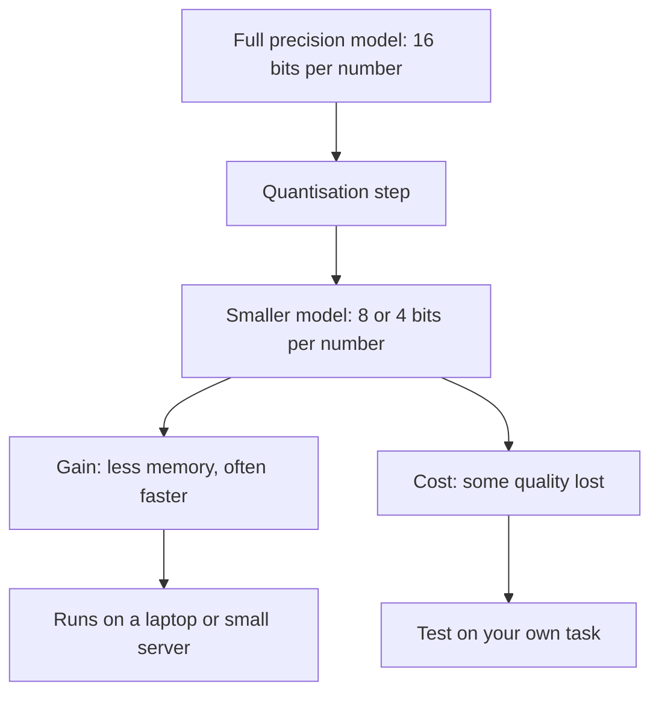

Open-weight models can be downloaded and run on your own hardware, but large ones need a lot of memory. Quantisation is the common way to make them fit.

**In one line:** quantisation shrinks a model by storing its numbers with less precision, like compressing a photo, so it fits in less memory and runs on smaller hardware, usually with a small loss in quality.

## The jargon: concepts covered on this page

- **Quantisation:** storing a model's numbers with fewer bits to save memory
- **Precision:** how exactly a number is stored, set by its bit count
- **Bit:** the smallest unit of computer storage, a 0 or a 1
- **Full precision:** the original, higher bit format a model was trained or shared in
- **4 bit / 8 bit:** common quantisation levels, using that many bits per weight
- **Quantised model:** a model whose weights have been stored at lower precision

## Why it matters

A model is a very large pile of numbers (its weights, see [what an LLM is](/start/what-an-llm-is/)). Those numbers have to sit in memory while the model runs. A big model in its original form can need expensive, specialised hardware.

Quantisation is what makes it possible to run capable [open-weight models](/under-the-hood/open-vs-closed-weights/) on a laptop or a modest server. Without it, many of them would be out of reach for a small team.

It also matters when you read model listings. You will see the same model offered in several sizes and "bit" levels, and knowing what that means helps you choose.

<mark>Quantisation trades a little quality for a lot of memory, and how much you lose depends on the model and your task, so test it on your own cases.</mark>

## How it works

**Precision, in plain words.** Every weight is a number, and a computer stores a number using a set count of bits (the smallest units of storage, each a 0 or a 1). More bits means the number can be recorded more exactly, like writing 3.14159 instead of 3.1.

Models are often trained and shared using 16 bits per number. Quantisation re-stores them with fewer bits, commonly 8 or 4. Some methods go lower, but quality usually falls more noticeably.

**The photo analogy.** A high resolution photo has millions of tiny colour shades. Compress it and it gets much smaller, and at a normal viewing size you cannot tell the difference. Compress it too far and you see blocky patches. Quantisation works the same way: moderate compression is hard to notice, heavy compression shows.

**Memory roughly follows bits.** Going from 16 bits to 8 bits roughly halves the memory needed for the weights. Going to 4 bits roughly quarters it. This is approximate: the model also needs working memory while it runs (for the conversation, see [tokens and context windows](/start/tokens-and-context-windows/)), and some parts are often left at higher precision.

**Quality.** Hugging Face's documentation on choosing a method describes 8 bit as giving accuracy very close to the unquantised model, 4 bit as giving relatively high accuracy, and going below 4 bits as bringing a noticeable drop, especially at 2 bits. It also advises always testing the quantised model on your own task. Results vary by method, model and task.

**Speed.** Smaller numbers mean less data to move around, which often makes the model respond faster (see [inference](/under-the-hood/inference/)). The gain depends on the hardware and software, so it is not guaranteed.

## In practice

Quantised versions of open models are published alongside the originals, often by the community, with names that mention the bit level. Tools that run models locally, such as Ollama or llama.cpp, mostly work with quantised files. Libraries such as those from Hugging Face can quantise a model when loading it.

Several methods exist (names you may meet include GPTQ, AWQ and bitsandbytes). You do not need to understand them to use one, only to know that they differ in quality, speed and effort.

**Providers quantise too.** Companies that host open models for others may serve a compressed version to cut costs and speed up replies. Quality can therefore differ between hosts of the same open model. A public comparison of one open model across hosting providers, discussed by developer Simon Willison, found large differences in test scores. The causes included an older serving program, settings that were not respected, and one provider that openly advertised a highly compressed version. After fixes, most providers' results converged. So it is a reasonable general caution: if you use a hosted open model, check what the host serves and test the output. Some hosts say which precision they use. Do not assume they all do.

## Worked example

Jo, a freelance researcher who also takes a part-time course, wants to tidy rough lecture notes into clean bullet points. The notes contain nothing sensitive, so running a small model on a laptop is acceptable.

1. **Pick a small open model** and download a 4 bit quantised version, sized to fit the laptop's memory.
2. **Run it locally** with a desktop tool and paste in a note.
3. **Collect ten real sets of notes** of different lengths and messiness, including a hard one with abbreviations.
4. **Run all ten** and read the outputs next to the originals. Did it drop action items? Invent names? Mangle dates?
5. **Try an 8 bit version** if the laptop has room, and compare the same ten.
6. **Decide.** If the 4 bit version is good enough on these, keep it. If it drops detail on the hard note, move up a level or use a larger model.

This is a tiny [eval](/running/evals/): a handful of real cases, checked the same way each time. It takes under an hour and tells Jo more than any general claim about the model.

## Costs and limits

- **Harder tasks suffer first.** Simple rewriting often survives heavy compression. Precise reasoning, arithmetic, long documents and exact formatting tend to degrade sooner.
- **Smaller is not always faster.** The speed gain depends on hardware and software support.
- **Savings are approximate.** Working memory for long conversations is extra.
- **Quality varies by model.** Some models compress well and others do not. A general rule is a guide, not a promise.
- **Hosted versions may differ from the original.** The same model name at two providers may not behave the same.
- **Common mistake.** Judging a model from a leaderboard score (its rank in a public table of test results), then running a more compressed version of it and expecting the same results. Test the exact version you will use.
- **Not a fix for capability.** A quantised small model is still a small model.

## Often confused with

**Quantisation vs fine-tuning.** Fine-tuning changes what a model knows or how it behaves, by training it further. Quantisation changes only how precisely its existing numbers are stored.

**Quantisation vs fewer parameters.** A smaller model has fewer weights. A quantised model has the same number of weights, each stored more cheaply. See [parameters and temperature](/under-the-hood/parameters-and-temperature/).

## Related

- [Open vs closed weights](/under-the-hood/open-vs-closed-weights/): quantisation is how open models fit onto smaller machines
- [Inference](/under-the-hood/inference/): the running of a model, where memory and speed matter
- [Evals](/running/evals/): how to check a quantised model on your own cases
- [Parameters and temperature](/under-the-hood/parameters-and-temperature/): what the numbers being compressed are

## Next up

Shrinking a model, or choosing between several, raises the question of how to tell which one is good enough. [Benchmarks](/under-the-hood/benchmarks/) covers the public tests used to compare models, and how far to trust them.
