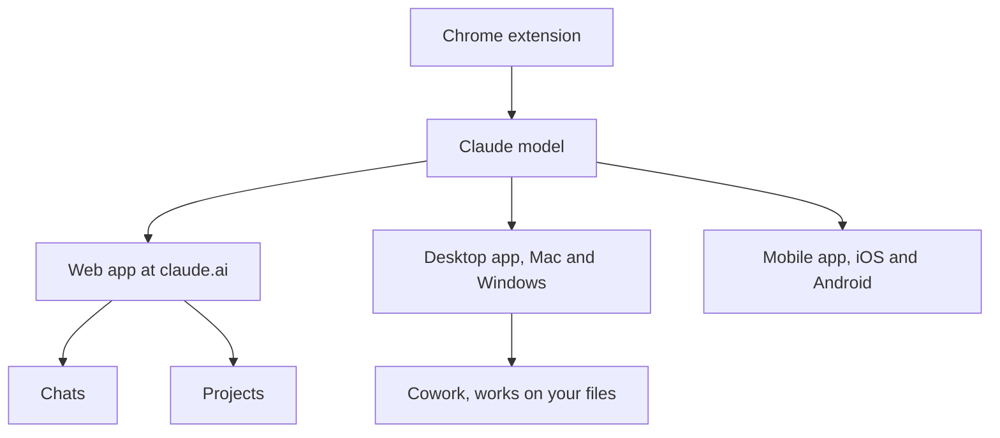

Once you have chosen between [free, a subscription or the API](/start/free-vs-subscription-vs-api/), the practical question is where you actually type and what each part of the app is for. This page is a tour of the Claude apps, using Claude as the worked case; ChatGPT and Gemini are laid out in a similar way.

**In one line:** the Claude apps are the web, desktop and phone versions of one chat service, with extra rooms inside for ongoing work (Projects), hands-on tasks on your computer (Cowork) and help inside web pages (Claude in Chrome).

*Snapshot, as of October 2026. Anthropic adds, renames and moves features often, so check its help pages at support.claude.com for current details.*

## The jargon: concepts covered on this page

- **Chat:** a single conversation with the model
- **Project:** a workspace with its own chats, files and instructions
- **Cowork:** Claude's agent mode in the desktop app for multi-step tasks on your files
- **Claude in Chrome:** a browser extension that lets Claude act in web pages
- **Artifact:** a document or small app Claude builds in a side panel
- **Research:** a mode that runs several searches and returns a cited answer

## Why it matters

Most people only ever use the chat box. That works, but it means re-explaining the same background every time, pasting the same files again, and asking a chat to do jobs it cannot reach, like tidying a folder on your laptop.

Knowing the rooms in the house saves that effort. A Project keeps the background for you, Cowork can touch your files, and the browser extension can work in a page you are signed into.

<mark>The model is the same in every Claude app; what changes is what it can see and what it can touch.</mark>

## Where it lives

If the model is the engine, the apps are the family car: nothing to install on the web, easy to drive, good for everyday trips.

- **Web, desktop and mobile.** The same account and chat history across claude.ai in a browser, a desktop app for Mac and Windows, and phone apps. Anthropic's help page lists macOS 11 or later and Windows 10 or later for the desktop app.
- **Chats.** One conversation each. Good for a single question or a short piece of drafting. Everything in a chat counts towards its [context window](/start/tokens-and-context-windows/), so very long chats get slower and use more of your allowance.
- **Projects.** A workspace with its own chats, uploaded files and standing instructions, so you set the background once. Anthropic says free accounts can create up to five, and paid plans get more capacity for project files. The full guide is [Projects and memory](/using-ai/projects-and-memory/).
- **Memory.** Claude can remember things about you and your work across chats, and you can review or switch it off in settings. Also covered in [Projects and memory](/using-ai/projects-and-memory/).
- **File uploads.** Drop in PDFs, Word files, spreadsheets, text and images. As of October 2026, Anthropic's help page gives a limit of 500MB per file and up to 20 files per chat, with a lower limit of 30MB per file for files added to a Project.
- **Cowork.** An agent mode in the desktop app. Instead of chatting, you describe an outcome ("sort these receipts into folders by month") and Claude carries out the steps on folders you choose. Anthropic lists it for paid plans, on Mac and on Windows (x64), as a research preview.
- **Claude in Chrome.** A browser extension that can read, click and navigate web pages alongside you, in a side panel. Anthropic lists it for paid plans, in Google Chrome only, as a beta.
- **Extras.** Connectors link Claude to other apps and data (see [connectors in Claude](/agents/connectors-in-claude/)). Research runs several searches and returns a cited report on paid plans. Artifacts are documents or small apps Claude builds in a side panel.

## Setting it up

1. **Sign in on the web first.** Go to claude.ai and create an account. Everything else uses the same login.
2. **Install the desktop app if you want Cowork.** Download it from claude.ai. Cowork needs the app to stay open while it works; Anthropic says closing it ends the session.
3. **Install the phone app** for quick questions, voice and photos on the go.
4. **Make one Project** for your main ongoing piece of work, add a few key files and a short paragraph of instructions.
5. **Check your settings.** Look at memory, connectors and what data is shared before you add anything sensitive.

On Windows: the desktop app needs Windows 10 or later, and Anthropic says Cowork does not run on Windows arm64 machines.

## Using it well

| If you want to... | Use |
| --- | --- |
| Ask a question, draft an email, think something through | A new chat |
| Keep files and instructions for an ongoing piece of work | A Project |
| Show Claude a document, spreadsheet or photo | Upload it to the chat or Project |
| Have Claude sort, rename or build files on your computer | Cowork in the desktop app |
| Have Claude work in a web page you are signed into | Claude in Chrome |
| Get a researched answer with sources | Research, with web search on |
| Edit a whole folder of code or a website | Claude Code, covered in [Claude Code and the API](/building/claude-code-and-the-api/) |

Some habits that help:

- **One chat per task.** Start fresh when the topic changes. Old turns cost allowance and can confuse the answer.
- **Put lasting background in a Project, not in your head.** If you keep pasting the same paragraph, it belongs in the Project instructions.
- **Give Cowork its own folder.** Grant only the folders it needs and keep private files elsewhere.
- **Be careful in the browser.** Pages can contain hidden instructions aimed at the AI, a trick called [prompt injection](/running/prompt-injection/). Anthropic advises reading its safety guidance before using browser and agent features.

## Worked example

Jo, a freelance researcher, is writing a report on bakeries that sell online. Jo makes a Project called "Bakery report", uploads the client brief and three industry PDFs, and writes two lines of instructions: British spelling, cite the page for every figure.

Each research question gets its own chat inside the Project, so the brief is always there without re-uploading. When a draft is ready, Jo opens Cowork in the desktop app, points it at the "Bakery report" folder and asks it to turn the notes into a formatted document with a contents page. Jo reviews the result before sending it.

## Costs and limits

- **Everything shares one allowance.** Chats, Projects, Research and Cowork all draw from your plan's usage limits. Agent work like Cowork uses it fastest.
- **Several features need a paid plan.** As of October 2026, Cowork, Claude in Chrome, Research and Claude Code are not on the free plan.
- **A chat in the browser cannot see your files.** Upload them, or use Cowork with a folder you grant.
- **Agent features carry more risk.** Anthropic calls Cowork a research preview, says its activity is excluded from audit logs and data exports, and advises against using it for regulated work.

## Often confused with

**Claude (the apps) vs Claude Code.** The apps are for people chatting and delegating everyday tasks. Claude Code is a separate tool for working on a folder of files, such as a website or codebase, and it is covered in Part 4.

## Related

- [Free, subscription or API](/start/free-vs-subscription-vs-api/): what each plan includes
- [Projects and memory](/using-ai/projects-and-memory/): keeping background across chats
- [Connectors in Claude](/agents/connectors-in-claude/): linking Claude to your other apps
- [Claude Code and the API](/building/claude-code-and-the-api/): the tools for building your own

## Next up

Knowing where to type is half the job; the other half is knowing what to type. [Prompt engineering](/using-ai/prompt-engineering/) covers how to ask so the answer comes back right first time.
