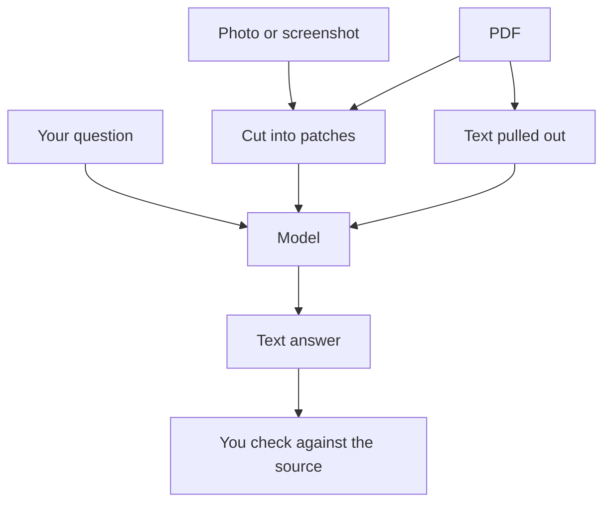

[Reasoning models](/using-ai/reasoning-models/) give a model more time to think about text. Much of what you want help with is not text, though: a photo of a receipt, a screenshot of an error, a PDF full of charts. This page covers handing those over and checking what comes back.

**In one line:** a multimodal model can take in more than one kind of material, such as text, images and documents, so you can share things as they are instead of retyping them.

## The jargon: concepts covered on this page

- **Multimodal model:** a model that handles more than one kind of material, such as text and images
- **Modality:** a kind of material, such as text, images, audio or video
- **OCR:** optical character recognition, software that turns a picture of text into editable text
- **Transcription:** turning speech in a recording into written text

## Why it matters

Plenty of everyday information is not plain text. Pitch decks and reports are full of charts. Invoices arrive as scans. A screenshot shows exactly what an error message said.

A text-only model cannot see any of that. A multimodal model can, which saves retyping and lets you ask about layout, charts and pictures directly.

<mark>A model reads a picture by prediction, just as it reads text, so it can misread a chart or a number and still sound sure.</mark>

## How it works

Each kind of material is called a **modality**: text, images, audio, video. A **multimodal model** handles more than one.

A model works on [tokens](/start/tokens-and-context-windows/), small pieces turned into numbers. An image is cut into small patches, and each patch is turned into numbers the model can read alongside your words. The picture then sits in the same [context window](/start/tokens-and-context-windows/) as your text, using up space like any other input.

**Taking in is not the same as producing.** Many assistants accept images but reply only in text. Some can also make images or speak, but that is a separate ability. When something is called multimodal, check which kinds of material go in and which come out.

## In practice

**In the Claude apps, as of October 2026,** Anthropic's help page lists these uploads:

- **Documents:** PDF, DOCX, CSV, TXT, HTML, ODT, RTF, EPUB and JSON, plus XLSX spreadsheets when code execution is turned on
- **Images:** JPEG, PNG, GIF and WebP
- **Limits:** up to 20 files per chat and 500MB per file, with images up to 8000 by 8000 pixels and PDFs up to 1,000 pages
- **How:** click the "+" button and choose "Add files or photos", drag files into the chat, or paste an image

One detail matters for PDFs. The help page says Claude looks at both the text and the visuals (charts, images, graphics) in PDFs of 100 pages or fewer. For longer PDFs it reads the text only, so a chart on page 150 is invisible. If the chart matters, upload just the pages you need. Limits change, so check the [current help page](https://support.claude.com/en/articles/8241126-upload-files-to-claude) before relying on them.

Audio and video files are not on that upload list. For a call recording, the usual route is a transcription tool first, then paste or upload the transcript.

**Good uses:**

- Asking what a chart or table in a report shows
- Pulling figures out of a receipt or invoice
- Pasting a screenshot of an error and asking what it means
- Getting a description of a photo, a diagram or a whiteboard

**Asking well.** Say which page or slide you mean, ask for the values in a list, and ask the model to say if anything is hard to read. That last line invites honesty instead of a confident guess.

## Worked example

An associate at Sample Ventures, a small venture capital fund, receives a pitch deck from Acme Payments. Slide 7 has a bar chart of monthly revenue, and she wants the figures for her notes.

1. **She uploads the PDF** and asks: "Read the revenue chart on slide 7 and list the monthly values. Say if any value is hard to read."
2. **The model replies** with six monthly figures and notes that the bars have no labels, so the values are estimates.
3. **She asks the founders** for the spreadsheet behind the chart.
4. **She compares.** Five figures match closely. One month is 61, not 63: a small misread of a bar.
5. **She records** the spreadsheet numbers and marks the chart readings as estimates.

The model saved time finding the data. Checking against the source caught the error.

## Costs and limits

- **Misreading.** Small text, dense charts, unlabelled bars, handwriting and blurry or rotated photos are common weak spots.
- **Invented detail.** A model can describe something that is not there (see [hallucination and grounding](/start/hallucination-and-grounding/)). Charts without labels invite estimates presented as facts.
- **Uses more of your allowance.** Images and PDF pages take up many tokens, and long decks fill the context window quickly, so you reach usage limits sooner. See [free vs subscription vs API](/start/free-vs-subscription-vs-api/).
- **Privacy.** Whatever you upload goes to the provider. Check your plan's data terms before uploading anything confidential; data rules are covered in Part 6.
- **Hidden instructions.** Text inside an image or document can try to steer the model, a trick called prompt injection (covered in Part 6). Be wary of files from people you do not know.
- **Not always the best tool.** To turn a clean scan into plain text, ordinary OCR software is often cheaper and more predictable.

## Often confused with

**Multimodal vs multi-model.** A multimodal model handles several kinds of material. A multi-model setup uses several different models, perhaps one to transcribe and another to summarise.

## Related

- [Tokens and context windows](/start/tokens-and-context-windows/): images and pages use up window space
- [Hallucination and grounding](/start/hallucination-and-grounding/): why chart readings must be checked
- [Claude apps](/using-ai/claude-apps/): where uploads happen
- [Projects and memory](/using-ai/projects-and-memory/): keeping files you use often in one place

## Next up

Thinking modes and uploads are choices you make chat by chat. [Recommended settings](/using-ai/recommended-settings/) gathers the safe defaults worth setting once, for your accounts, tools and spending.
