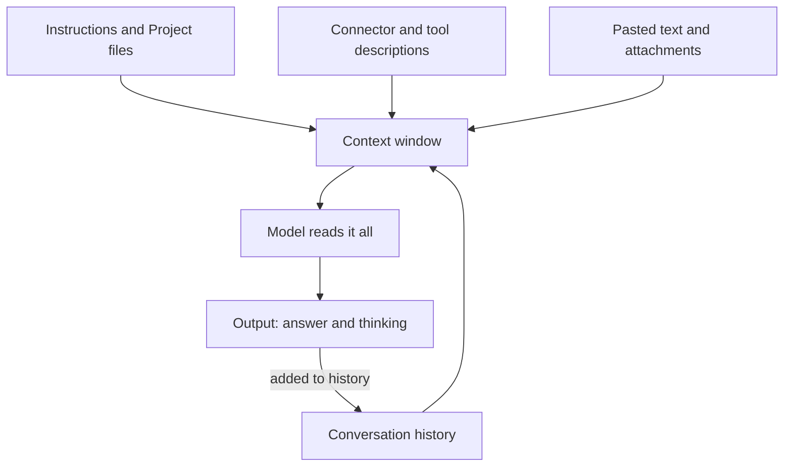

[Recommended settings](/using-ai/recommended-settings/) put a cap on spending. The habits on this page keep the fuel bill low in the first place, mostly by giving the model less to read.

**In one line:** keep each chat short and focused, send the model less to read, and use the smallest model that does the job.

## The jargon: concepts covered on this page

- **Usage window:** a time period after which a subscription allowance resets
- **Usage credits:** optional paid extra usage once a subscription allowance runs out
- **Context management:** the app summarising older messages so a long chat can continue
- **Extended thinking:** a setting that lets the model reason before answering, at extra cost
- **Model picker:** the menu in the chat box for choosing which model answers

## Why it matters

A token is a small chunk of text, and every token a model reads or writes counts against something: a subscription's usage allowance, or an API bill. Most waste comes from a few habits, not from any single big request. Long chats, huge pasted documents and unused connectors quietly add up.

The mechanism is easy to miss. A model has no memory between turns, so the app sends the whole conversation again each time you press enter. A one-line question at the end of a week-long chat still carries everything before it.

<mark>Every turn pays for the whole conversation so far, so the cheapest token is the one you never put into the chat.</mark>

Details here are as of October 2026. Limits and menu names change, so treat the habits as the lasting part.

## How it works

Think of the context window (the space the model can read at once, see [tokens and context windows](/start/tokens-and-context-windows/)) as a desk. Everything on the desk is looked at again on every turn. Five things sit on it.

- **Instructions:** your account and Project instructions, plus the app's own built-in instructions.
- **Tools:** descriptions of the connectors and features switched on. Each one adds to the desk.
- **History:** everything said so far, which grows each turn.
- **Pasted text and attachments:** often the biggest part.
- **Output:** what the model writes, including hidden reasoning, which counts like output.

On paid plans, the apps summarise earlier messages automatically when a chat nears the context limit, so long chats can carry on. That softens the problem but does not remove it, so the habits below still matter.

## Habits that help most

Ranked roughly by how much they save.

1. **Start a new chat for each new task.** When you change topic, open a fresh chat instead of carrying on. The old history is no longer useful, but it is still read on every turn. If you need something from the old chat, copy over a short summary.

2. **Use a Project for background you repeat.** Instead of pasting the same brief or style guide into every chat, put it in a Project once. Keep Project knowledge and instructions short, because they are read in each chat. On paid plans, large Project knowledge is searched rather than read in full. See [projects and memory in practice](/using-ai/projects-and-memory/).

3. **Paste the part, not the whole.** Pasting a 60-page document puts all of it on the desk for every later turn. Paste the relevant section, or ask a narrow question about one part.

4. **Be specific.** "Tidy this up" invites a long reply and a second round. "Shorten this paragraph to two sentences for a client email" gets it right first time. This is [prompt engineering](/using-ai/prompt-engineering/) paying for itself.

5. **Edit instead of piling on corrections.** If the first answer missed the point, edit your original message and resend it, rather than adding "no, I meant..." underneath. The failed attempt then stops riding along in the history.

6. **Choose a smaller model for easy work.** The model picker in the chat box lets you switch. Larger models are slower and use your allowance faster; keep them for hard reasoning. See [model tiers](/models/model-tiers/).

7. **Save thinking for hard problems.** Extended thinking, where the model reasons before answering, counts like output. Leave it off for quick questions, and turn it on when the task needs it. See [reasoning models](/using-ai/reasoning-models/).

8. **Switch off connectors and features you are not using.** In a chat, the "+" button opens a Connectors menu where you can switch each one off for that conversation. Fewer tools on the desk means less to read every turn.

If you use Claude Code as well, its own habits (clearing sessions, compacting, keeping CLAUDE.md short) are in [keeping Claude Code sessions lean](/building/claude-code-in-depth/#keeping-claude-code-sessions-lean).

## Worked example

Sam runs Bramley's, a two-person bakery, and uses Claude for product descriptions, supplier emails and the odd question about allergens. For months it all happened in one long chat, and Sam kept hitting the usage limit by mid-afternoon.

The fix took ten minutes. Sam made a Project called "Shop writing" with a one-page brand guide and three example descriptions, and an instruction: "Warm, short, British spelling." Each new product now gets its own fresh chat in that Project. Supplier emails go in separate chats, using a smaller model, because they are simple.

Same work, far less on the desk each turn, and the limit stops arriving before the end of the day.

## Costs and limits

There are two billing worlds, and they behave differently. A subscription gives a usage allowance that resets over time: Anthropic describes a session window of several hours plus a weekly allowance. On Pro and Max plans this is shared across the Claude apps and Claude Code, and optional usage credits let you keep going at extra cost, with a cap you set. The API charges per token, with spend limits you set yourself.

On a subscription you hit a wall; on the API you get a bill. Neither tells you in advance which task will be expensive. The Usage page in Settings shows how much of your allowance you have used.

Anthropic says the amount you can do depends on how long your messages and conversations are, the files you attach, the features you switch on, the model you choose and its effort level. Nearly all of that is in your hands, which is why the habits above work.

When things go wrong:

- **"You've hit your limit."** On a subscription this is a usage window, not a bill. The message shows when it resets.
- **A chat feels slow.** It is probably long. Ask for a short summary of the decisions so far, start a new chat, and paste the summary in.
- **Usage jumps with no obvious reason.** Look for a very long chat, a large Project, big attachments or several connectors switched on at once.

## Related

- [Tokens and context windows](/start/tokens-and-context-windows/): what is actually being counted
- [Projects and memory in practice](/using-ai/projects-and-memory/): background without re-pasting
- [Free, subscription or API](/start/free-vs-subscription-vs-api/): the two billing worlds in more detail
- [Prompt caching and batch processing](/running/prompt-caching-and-batch-processing/): how repeated text gets cheaper for builders
- [Recommended settings](/using-ai/recommended-settings/): spending limits and connector hygiene

## Next up

That completes the everyday toolkit for using AI well. Part 3 looks under the bonnet of agents, starting with [tool use](/agents/tool-use/): how a model goes from writing text to taking actions in other software.
