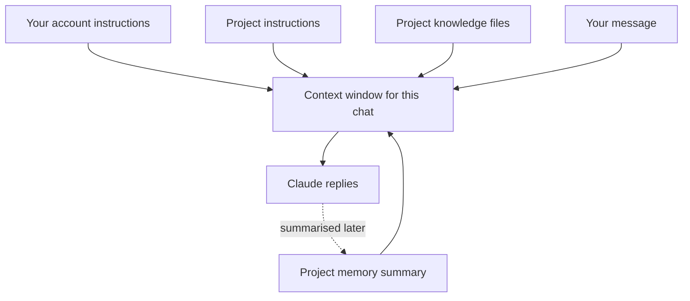

A [system prompt](/using-ai/system-prompts/) sets standing rules for every conversation. Projects and memory are the two everyday ways the Claude apps carry rules and background from one chat to the next, so you stop repeating yourself.

**In one line:** a Project is a workspace you set up on purpose, with its own files and instructions, while memory is a summary Claude keeps of your past chats and brings back into new ones.

*Snapshot, as of October 2026. Menu names and plan details come from Anthropic's help pages at support.claude.com. Apps change often, so if a label looks different, search the help centre for the feature's name.*

## The jargon: concepts covered on this page

- **Project:** a workspace in the Claude apps with its own knowledge, instructions and chats
- **Project knowledge:** files uploaded to a Project for Claude to use in its chats
- **Project instructions:** standing rules that apply only to chats in one Project
- **Memory:** a summary of past chats that Claude keeps and brings into new ones
- **Chat search:** letting Claude look through earlier conversations on request
- **Incognito chat:** a chat saved to neither history nor memory
- **Instruction file:** a plain text file of standing rules an agent reads at the start of each session

## Why it matters

A model forgets everything when a chat ends. Without help, you would paste the same background, the same file and the same "please use British spelling" into every new conversation. That is tedious, and it wastes tokens.

The Claude apps offer two fixes that look similar but behave very differently. A Project holds exactly what you put in it. Memory decides for itself what to keep, based on what you talked about.

<mark>Use a Project when you want to choose exactly what Claude knows, and memory when you are happy for Claude to pick up useful background on its own.</mark>

Knowing which is which also matters for privacy. Anything in a Project or in memory can turn up in later answers, so it is worth knowing where it lives and how to remove it.

## Where it lives

### Projects

A Project is a folder for related chats. It has three parts:

- **Project knowledge:** files you upload, such as documents, text files or code. Claude can use them in every chat in the Project.
- **Project instructions:** standing rules for chats in this Project only, such as the tone, the audience or what to avoid. This is a system prompt you write yourself.
- **Chats:** each conversation started inside the Project sees its knowledge and instructions.

To create one, open Projects from the sidebar (or go to claude.ai/projects) and choose New Project. Projects are available on every plan, including Free, which allows up to five. On Team and Enterprise plans you can share a Project with colleagues, either so they can use it ("Can use") or also change its instructions and knowledge ("Can edit").

When the files in a Project grow close to what fits in the context window (the amount of text the model can read at once), paid plans switch to a search mode automatically. Claude then looks up the relevant parts instead of reading everything. That technique is called retrieval-augmented generation, or RAG, covered in [RAG and chunking](/data/rag-and-chunking/).

### Memory

Memory is a short summary of what Claude has learned from your past chats, such as your job, your projects and how you like answers. Claude writes it, updates it roughly every 24 hours, and brings it into new chats. Each Project has its own separate memory, so a work Project and your personal chats do not mix.

Memory is available on all plans, Free included. A related feature, "Search and reference chats", lets Claude look through earlier conversations when you ask about them. It is on paid plans only.

### Incognito chats

An incognito chat is not saved to your chat history or to memory, and Claude will not draw on it later. Start one with the ghost icon in the top right of a new chat. On Team and Enterprise plans, the organisation may still keep incognito chats for a minimum period under its own policy.

## Setting it up

1. **Look at your memory.** Go to Settings, then Capabilities, and choose "View and edit memory". Read what is there. Delete or correct anything wrong or anything you would rather it did not keep.
2. **Tell it directly.** You can also say in a chat "remember that I prefer short answers" or "forget my old job title", and Claude updates the summary.
3. **Pause or reset if you want.** In the same place you can pause memory (Claude keeps what it has but adds nothing new) or reset it. Reset is permanent and cannot be undone. On Enterprise plans an owner can switch memory off for the whole organisation.
4. **Make a Project for each repeated job.** Add the two or three files Claude needs and a few lines of instructions. Name it after the job, not the date.
5. **Use incognito for one-offs** you do not want remembered, such as a sensitive personal question or a test.

Everything in the diagram lands in the same context window, which is why a Project with a pile of large files costs more per message than a bare chat.

## Using it well

The Claude apps are not the only place standing rules can live. When you start building with AI tools, you will meet instruction files: plain text files kept in a work folder, such as a file called CLAUDE.md, that an agent reads at the start of every session. They are covered later in [skills and instruction files](/agents/skills-and-instruction-files/).

| You want... | Use | Why |
| --- | --- | --- |
| Claude to know a fixed set of documents for one piece of work | A Project | You choose exactly what goes in |
| The same tone and rules for one kind of task | Project instructions | Applies only where it should |
| Claude to recall your role and preferences everywhere | Memory | Picks up background without effort |
| A rule that applies to every chat you ever have | Account instructions | Always present, see [system prompts](/using-ai/system-prompts/) |
| A chat that leaves no trace in history or memory | Incognito chat | Nothing carried forward |
| Rules an agent follows while working on files | An instruction file | Lives with the work, can be versioned |
| Colleagues to share the same set-up | A shared Project on a team plan | Everyone gets the same knowledge and rules |

A few habits help:

- **Keep Project knowledge lean.** Upload the documents that matter, not everything you have. Smaller is cheaper and more accurate.
- **Read your memory now and then.** It is a summary written by a model, so it can be out of date or slightly wrong.
- **Keep private and work topics apart.** Separate Projects keep their own memory, which stops one bleeding into the other.
- **Put rules in writing.** If something must always happen, write it into instructions rather than hoping memory picked it up.

## Worked example

Jo is a freelance researcher who also takes a part-time course. She sets up two Projects.

The first, "Client briefs", holds her house style guide and a template for research summaries. Its instructions say: "Write for busy non-specialists. British spelling. Cite a source for every figure. Flag anything you are unsure of." Every new brief starts in this Project, so she never re-explains the format.

The second, "Course", holds the reading list and her lecture notes. Because each Project keeps its own memory, Claude's notes about her client work stay out of her study chats.

Outside both, memory has learned that Jo likes short answers with headings. When she wants to ask about a client's confidential product idea she would rather not have remembered, she uses an incognito chat.

## Costs and limits

- **Projects cost context.** Project knowledge and instructions are read in each chat, so large files use up your allowance faster. See [not burning tokens](/using-ai/not-burning-tokens/).
- **Memory is a summary, not a record.** It is updated roughly once a day, it can miss things, and it can be wrong. Do not rely on it for facts that matter.
- **Plan limits apply.** Free accounts get up to five Projects, and chat search needs a paid plan. Sharing Projects needs a Team or Enterprise plan. Details change, so check the current help page.
- **Neither is a security boundary.** Anything you put in a Project or memory can come out in an answer. Do not upload passwords, keys or data you are not allowed to share.

## Often confused with

**Memory vs Projects.** Memory is written by Claude, from what you said. A Project is written by you, from what you chose to upload. Memory is convenient; a Project is predictable.

**Memory in the apps vs memory in agents.** The app feature is one product's way of keeping notes. The general idea of an agent saving notes and reading them back later is covered in [memory](/agents/memory/).

## Related

- [System prompts and custom instructions](/using-ai/system-prompts/): the standing rules that Project instructions are a form of
- [Memory](/agents/memory/): how any agent keeps a logbook between sessions
- [Skills and instruction files](/agents/skills-and-instruction-files/): standing rules kept in files next to the work
- [Recommended settings](/using-ai/recommended-settings/): privacy and memory settings worth checking
- [RAG and chunking](/data/rag-and-chunking/): how large Project knowledge gets searched

## Next up

With the right background in place, the next question is how hard the model should think about each request. [Reasoning models](/using-ai/reasoning-models/) explains models that work through a problem before answering, and when that extra effort pays off.
