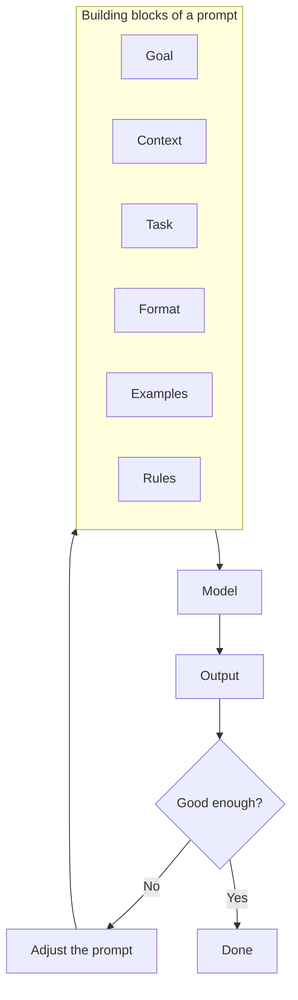

Whichever app you type into, the answer depends heavily on what you type, because a model can only use what is in its context window. A prompt is the set of directions you hand the driver, and this page is about giving clear ones.

**In one line:** prompt engineering is writing the instructions and background you give a model so that it does what you actually want.

## Why it matters

The same model can give a vague, generic answer or a sharp, useful one, depending only on how it was asked. A model can't read your mind or see your situation. It has only the words you gave it.

Better prompts are the cheapest improvement available. They cost nothing to try, need no technical setup, and often fix problems people blame on the model.

<mark>The model can only work from what is in the prompt. If you didn't say it, the model has to guess.</mark>

## How it works

A **prompt** is the text you send to a model. A good one usually has some or all of these building blocks:

- **Goal:** what you want and what it is for.
- **Context:** background the model can't know, such as who the audience is or what has already happened.
- **Task:** the specific job, stated precisely.
- **Format:** how the answer should look, such as a table, five bullet points or two sentences.
- **Examples:** one to three samples of the output you want.
- **Rules:** what to avoid, and what to do when something is missing or unclear.



Prompting is a loop, not a single attempt. You try a prompt, look at what came back, work out what was missing, and change the prompt.

Some terms you will see:

- **Zero-shot** means asking with no examples.
- **Few-shot** means including a few examples. This is one of the most reliable ways to get a particular style or layout.
- **Chain-of-thought** means asking the model to work through a problem step by step before answering. Many newer models do this on their own, so it matters less than it used to.

## In practice

Most prompts are typed into a chat. Prompts you use often can be saved as templates, with blanks to fill in, such as the email text or the company name.

In an agent, prompts live in several places. The standing instructions are a [system prompt](/using-ai/system-prompts/), and each tool has a short description of its own (see [tool use](/agents/tool-use/) in Part 3). Longer, reusable instructions are often kept in files.

Test a prompt on several real cases, not just one. A prompt that works on your favourite example can fail on the awkward ones.

Check your organisation's rules before pasting confidential material into any tool. A good prompt does not need private data to explain what you want.

## Worked example

An associate at Sample Ventures, the fictional fund, wants to log introduction emails. Here is a weak prompt:

```text
Summarise this email.
```

The result is a paragraph. It might mention the founder or might not, and the layout changes every time.

Here is a stronger one:

```text
You are helping an associate at an early-stage venture fund.
Below is an email introducing a founder to us.

Extract these five things as a table: founder name, company,
a one-line description of the company, who made the introduction,
and anything the sender asks us to do.

If something is not in the email, write "not stated". Do not guess.

Email:
[email text goes here]
```

The second version states the goal, the task, the format and the rule for missing information. The result is the same shape every time, and a gap shows up as "not stated" instead of an invented detail.

## Costs and limits

- **Longer prompts cost more.** A prompt is read again on every request. Keep it as short as it can be while still being clear.
- **Too many rules backfire.** A long list of instructions, some pulling against each other, can confuse the model.
- **Prompts can be fragile.** A wording that works well with one model may behave differently with another, so re-test after a switch.
- **A good prompt doesn't make facts true.** The model can still [hallucinate](/start/hallucination-and-grounding/) (state something false with complete confidence). Asking for sources helps, but it doesn't remove the risk.
- **There are no magic phrases.** Clear and specific beats clever.

The most common mistake is writing a vague request and then blaming the model for a vague answer.

## Often confused with

**Prompt engineering vs context engineering.** Prompt engineering is about the wording of instructions. [Context engineering](/data/context-engineering/), covered in Part 5, is about everything the model sees, including fetched documents and tool results. Prompts are one part of the context.

**Prompt vs system prompt.** A prompt is whatever you send. A system prompt is the standing set of instructions that comes before every conversation.

## Related

- [System prompts and custom instructions](/using-ai/system-prompts/): the standing instructions behind a product or agent
- [Context engineering](/data/context-engineering/): choosing everything the model sees
- [What an LLM is](/start/what-an-llm-is/): why the model depends so heavily on its input
- [Evals](/running/evals/): how to test whether a prompt change really helped

## The proper terms

- **Chain-of-thought:** asking a model to reason step by step before it answers
- **Few-shot prompting:** including a few examples in the prompt
- **Prompt:** the text you send to a model
- **Prompt engineering:** writing prompts so a model does what you intended
- **Prompt template:** a saved prompt with blanks to fill in
- **Zero-shot prompting:** asking with no examples

## Next up

Some directions apply to every trip, not just one. [System prompts and custom instructions](/using-ai/system-prompts/) covers the standing instructions a model receives before any conversation starts, and how to write your own.
