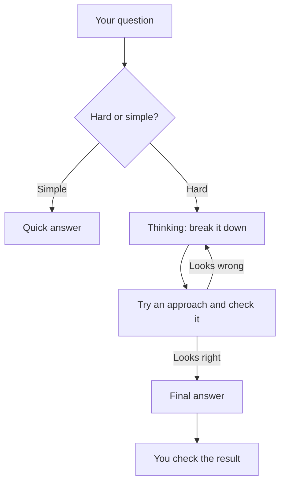

[Projects and memory](/using-ai/projects-and-memory/) give a model more to work with. This page is about giving it more time: switching on thinking so the model works a problem through before it replies, and knowing when that is worth the wait.

**In one line:** a reasoning model writes out its own working before it answers, which helps on hard, multi-step problems but takes longer and uses more of your allowance.

## The jargon: concepts covered on this page

- **Reasoning model:** a language model trained to think step by step before answering
- **Extended thinking:** the setting that lets a model think before replying, as named in the Claude apps
- **Chain of thought:** the working a model writes out before its answer
- **Effort level:** a setting for how much a model should think, from low to max

## Why it matters

Some questions can be answered at a glance, such as "what is the capital of France?". Others need working out, such as "if flour goes up and butter goes up, what should a croissant cost to keep the same margin?". A model answering straight away can jump to the wrong answer on the second kind.

Reasoning models give the model room to work before it commits. For maths, planning, tricky comparisons and long documents with lots to cross-check, this often makes a clear difference.

<mark>Thinking longer makes a model better at hard problems, but it does not make it truthful, so check the answer, not just the working.</mark>

## How it works

Think of the difference between blurting out an answer and doing the sum on scrap paper first. A reasoning model gets the scrap paper.

Before the final answer, the model writes a stretch of working: breaking the problem into parts, trying an approach, noticing a mistake, trying again. This is often called the **chain of thought**. It is written one [token](/start/tokens-and-context-windows/) at a time like any other text, so thinking uses tokens (fuel, in the car picture) just as the answer does.

A reasoning model is still a [language model](/start/what-an-llm-is/) underneath. It has had extra training to think before it answers, so it is a change in behaviour, not a different technology. How that training works is covered in Part 7, in [LLMs, LRMs and LQMs](/under-the-hood/llms-lrms-and-lqms/).

## In practice

Most major AI assistants now offer a thinking mode alongside quick answers. In some, you switch it on yourself. In others, the newest models think whenever they judge a question needs it.

**In the Claude apps, as of October 2026,** Anthropic's help page says you click the model name next to the send button. Depending on the model, you either switch the "Extended" toggle on or off, or open "Effort" and switch "Thinking" on or off. Effort levels run from low up to max, and the help page notes that on some of the newest models thinking cannot be turned off. While Claude thinks you see a timer, and afterwards an expandable "Thinking" section above the reply showing a summary of its working. Menus change often, so check the [current help page](https://support.claude.com/en/articles/10574485-using-extended-thinking) if yours looks different.

**Switch thinking on (or effort up) for:**

- Multi-step sums and pricing questions
- Planning with constraints, such as a timetable or a budget
- Comparing options against several criteria
- Checking a long document for contradictions
- Hard writing tasks where structure matters, such as an argument with several parts

**Leave it off (or effort low) for:** quick facts, rewording, summaries of short text, formatting, and brainstorming. Thinking adds wait and usage there and little else.

You no longer need to write "think step by step" in your [prompt](/using-ai/prompt-engineering/) when thinking is on, because the model does it by design. A clear question with all the facts still matters more than any setting.

## Worked example

Sam runs Bramley's, a two-person bakery. Flour has gone up and butter has gone up by a different amount, and Sam wants to know what a croissant should now cost to keep the same margin. Sam pastes in the recipe quantities, the old and new ingredient prices, and the current selling price.

**With thinking off,** the reply comes back in seconds with a confident new price. On a second look, it applied the butter increase to the whole recipe cost, not just the butter, so the price is too high.

**With thinking on,** the reply takes longer. The thinking summary shows it costing each ingredient, applying each rise separately, working out the old margin, and then solving for the new price. The answer matches a quick check Sam does in a spreadsheet.

Two lessons follow. Thinking helped because the question has several ordered steps. But Sam still checked the result, because a model can slip on arithmetic and on anything the question left vague. For the follow-up question, "what does 'gross margin' mean?", thinking is not needed at all.

## Costs and limits

- **Slower.** Thinking happens before the answer appears, from a few seconds to minutes on hard problems.
- **Uses more of your allowance.** Thinking counts as tokens even when you only see a summary. Anthropic's help page says higher effort uses more tokens, so you reach your usage limits faster. Plans and limits are explained in [free vs subscription vs API](/start/free-vs-subscription-vs-api/).
- **Diminishing returns.** Beyond a point, more thinking stops helping, and sometimes the model talks itself into a worse answer.
- **Still wrong sometimes.** Thinking does not remove [hallucination](/start/hallucination-and-grounding/). A model can reason carefully from a made-up fact.
- **The working can mislead.** A tidy chain of thought makes a wrong answer look well supported, and research suggests the shown working does not always reflect everything that shaped the answer.
- **Not a calculator.** For figures that must be exact, check them in a spreadsheet.

The most common mistake is leaving maximum thinking on for everything. Match the effort to the difficulty.

## Often confused with

**Thinking mode vs "think step by step".** Asking any model to show its working is a prompting trick. A reasoning model has been trained to do long working on its own, so the trick is mostly unnecessary.

**Reasoning vs human thinking.** "Reasoning" is a handy label, and researchers disagree about how far the comparison goes. What is observable is that writing out steps helps the model on hard problems.

## Related

- [What AI is good and bad at](/start/what-ai-is-good-and-bad-at/): where thinking helps and where it does not fix the weak spots
- [Prompt engineering](/using-ai/prompt-engineering/): a clear question matters more than any setting
- [Hallucination and grounding](/start/hallucination-and-grounding/): why even careful reasoning needs checking
- [LLMs, LRMs and LQMs](/under-the-hood/llms-lrms-and-lqms/): how reasoning models are trained, in the optional deep dives

## Next up

Thinking helps a model with hard questions about text. Much of what you want help with arrives as photos, scans and PDFs, and [multimodal models](/using-ai/multimodal-models/) covers how to hand those over and where the model slips.
