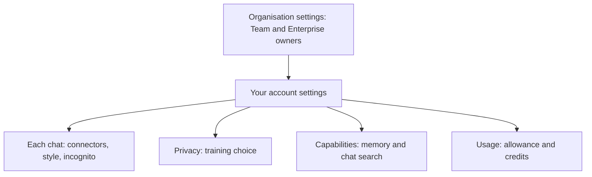

[Multimodal models](/using-ai/multimodal-models/) can read your documents, images and screenshots, which makes it more important to decide what the apps may keep, connect to and spend. This page gathers the settings that matter for safety in the Claude apps into a single checklist, so the locks are on before anything goes wrong.

**In one line:** switch on the safety settings before you need them: the right privacy choice, memory you have checked, trimmed connectors, protected sign-in and a spending limit.

## The jargon: concepts covered on this page

- **Training setting:** the choice of whether your chats can be used to train future models
- **Incognito chat:** a chat saved to neither history nor memory
- **Connector:** a link that lets Claude read from or act in another service
- **Two-factor authentication:** signing in with a password plus a second proof such as a phone code
- **Recovery codes:** one-time codes that let you back into an account if your second factor is lost
- **Usage credits:** optional paid extra usage once a subscription allowance runs out
- **Spend limit:** a cap on money spent, after which use stops

## Why it matters

Most AI tools ship with defaults that favour convenience. That is fine for idle questions. For a small business or anyone handling other people's information, the same defaults can mean chats used in ways you did not expect, a connector with more access than it needs, or a bill nobody noticed.

The good news is that a handful of settings do most of the work. None of them needs technical skills, and most take a few minutes. They are also boring, which is the point: you set them once and stop worrying.

Each item below says what the setting does, why it matters and where to find it. Details are as of October 2026 and come from Anthropic's help pages. Menus move, so if a label differs, search the help centre for the setting's name.

<mark>Settings that stop a mistake from happening beat instructions that ask the assistant to be careful, because the assistant can ignore an instruction but cannot ignore a rule the app enforces.</mark>

## How it works

Settings in the Claude apps come in three layers. On a Team or Enterprise plan, the organisation's owners set limits at the top. Your own account settings sit in the middle and follow you to every device. Each chat sits at the bottom, where you can switch connectors on or off, or choose an incognito chat.

A higher layer can restrict a lower one. If a setting will not change, an organisation owner has probably set it.

If you also use Claude Code, the coding tool, its own settings (permission modes, blocking secret files, keeping keys out of git) are in [recommended settings for Claude Code](/building/claude-code-in-depth/#recommended-settings-for-claude-code).

## The checklist

### Privacy and memory

1. **Learn the training rule for your plan.** On Free, Pro and Max accounts, the setting is "Help improve our AI models" under Settings, then Privacy. It decides whether your chats can be used to train future models, and it also covers Claude Code sessions from those accounts. Under commercial terms (Team, Enterprise and the API), Anthropic says it does not train on your prompts unless the customer opts in to a programme such as the Development Partner Program. Switching the setting off only affects future chats, and chats flagged by safety systems can still be used for safety work. For business or client data, use a commercial plan and read [data terms at a glance](/models/data-terms-at-a-glance/) and [GDPR, data retention and DPAs](/running/gdpr-data-retention-and-dpas/).

2. **Check what memory holds.** Memory and chat search live under Settings, then Capabilities. Choose "View and edit memory" to read the summary Claude keeps and correct it. You can pause memory (it keeps what it has but adds nothing) or reset it, which is permanent. "Search and reference chats", on paid plans, lets Claude look through earlier conversations, and you can switch it off there too. See [projects and memory in practice](/using-ai/projects-and-memory/).

3. **Use incognito for one-off sensitive chats.** The ghost icon in the top right of a new chat starts an incognito chat, which is saved to neither your history nor memory. On Team and Enterprise plans, the organisation may still keep it for a set period.

4. **Know your organisation's controls.** On Enterprise plans an owner can switch memory off for everyone under Organisation settings, then Capabilities, which also deletes existing memory. If you run a team, decide this on purpose rather than leaving the default.

### Connectors

5. **Turn off what you are not using.** Each connector is a door into another service, and a cost in context (see [MCP](/agents/mcp/), a standard way of plugging tools into AI, covered in Part 3). Manage them in the Connectors section of Settings. Inside a chat, the "+" button in the chat box opens a Connectors menu where you can switch each one on or off for that conversation.

6. **Prefer reviewed connectors.** The connectors directory lists ones Anthropic has reviewed. Be wary of custom connectors from unknown sources, and treat any connector that fetches outside content, such as web pages or emails, as a route for [prompt injection](/running/prompt-injection/) (hidden instructions planted in content the assistant reads).

7. **Start read-only.** Where a connector offers read and write access, give it read access first. On Team and Enterprise plans, owners can set each connector's tools to "Always allow", "Needs approval" or "Blocked". See [least privilege](/running/least-privilege/).

### Accounts

8. **Protect the sign-in behind your Claude account.** Claude accounts have no password: you sign in with Google or an emailed link, and the help pages do not describe a separate two-factor option. So switch on two-factor sign-in (a second proof, such as a code from an app, on top of your password) for the Google account or email behind it, and save the recovery codes somewhere safe, away from the device.

9. **Keep experiments and real data apart.** Use a separate Project, or a separate account, for trying things out. If you use the API through the Claude Console, workspaces let you split testing from real use, each with its own spend limit.

### Spending

10. **Set a limit on extra usage.** On Pro and Max plans, usage credits let you keep going after your allowance runs out, at extra cost. Find them under Settings, then Usage, where you can switch them on or off and choose "Adjust limit" to set a monthly cap. API users can set spend limits per workspace in the Claude Console. See [estimating cost per task](/running/estimating-cost-per-task/).

## Good habits

- Do the checklist once, then put a reminder in your calendar to repeat it every few months.
- Read your memory summary at the same time, and delete anything you would not want repeated.
- Use a password manager, and never type or paste a password or key into a chat.
- Write down which account and which Projects hold what data, so you know where to look if something leaks.

## When things go wrong

- **A setting will not change.** An organisation owner may control it. Ask whoever runs your Team or Enterprise plan.
- **Claude brings up something you did not want remembered.** Open "View and edit memory" and remove it, or tell Claude in a chat to forget it.
- **A password or key was pasted into a chat.** Treat it as leaked: change the password or revoke the key at the provider, and create a new one. Deleting the chat afterwards is not enough.
- **You are locked out of the account behind Claude.** Use your recovery codes. This is why you saved them.
- **A connector did something you did not expect.** Switch it off in the chat's Connectors menu, check the connected service for changes, and reconnect only with narrower access.

## Costs and limits

Most of these settings are free. Two-factor sign-in, memory checks and connector clean-ups cost nothing but a few minutes.

Some controls depend on your plan. Organisation-wide controls need a Team or Enterprise plan, and chat search needs a paid plan. Plan names and features change, so check the vendor pages.

A spending limit protects you from a surprise bill but can also stop work mid-task. Set it a little above what you normally use, so you hear about unusual use before it stops you.

## Related

- [Projects and memory in practice](/using-ai/projects-and-memory/): what memory and Projects keep, and how to control them
- [Least privilege](/running/least-privilege/): the principle behind every read-only connector
- [MCP](/agents/mcp/): what you are switching on and off in the connector list
- [Data terms at a glance](/models/data-terms-at-a-glance/): training and retention rules by provider
- [Claude Code in depth](/building/claude-code-in-depth/#recommended-settings-for-claude-code): the settings checklist for Claude Code
- [Not burning tokens](/using-ai/not-burning-tokens/): the usage side of the same discipline

## Next up

Settings keep you safe; habits keep usage affordable. [Not burning tokens](/using-ai/not-burning-tokens/) covers how to make your allowance, and the fuel bill, go further day to day.
