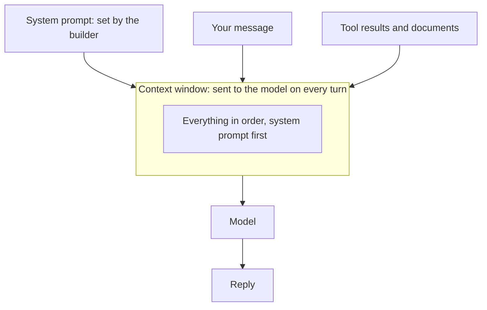
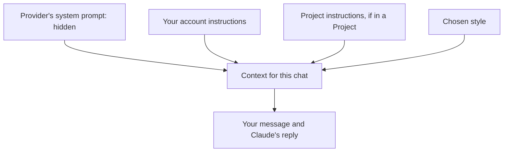

[Prompt engineering](/using-ai/prompt-engineering/) is about giving clear directions for one request. A system prompt sets the standing rules of the road, which apply to every request in the conversation, and custom instructions are the version you can write yourself.

**In one line:** a system prompt is a set of standing instructions given to a model before the conversation begins, setting its role, rules and tone for everything that follows.

## Why it matters

When you use a product built on a model, you don't retype its rules each time. Something tells the model it is a research assistant, to keep answers short, and to refuse certain requests. That something is the system prompt.

For agents, it is where much of the behaviour is defined: what the agent is for, which tools to prefer, what it must never do. It is also the first place to look when an agent behaves oddly.

<mark>A system prompt is a strong suggestion, not a lock. Limits that must hold belong in the tools and permissions, not only in words.</mark>

## How it works

Each message in a conversation has a **role**. The **system** role is for instructions from whoever built the application. The **user** role is for what you type. The **assistant** role is for what the model writes back.

The system prompt sits at the start of the [context window](/start/tokens-and-context-windows/), ahead of everything else, and it is sent again with every turn. The model has no memory of it between requests, so it has to be there each time. You usually can't see it.

Models are trained to treat the system prompt as more authoritative than the user's messages. That is a tendency, not a guarantee. A determined user, or text that arrives inside a tool result, can sometimes talk a model out of its instructions.



Typical contents are: the role and purpose, the tone, rules and boundaries, guidance on which [tools](/agents/tool-use/) to use and when, the output format, and what to do when it is unsure.

## In practice

Chat products have a system prompt written by the provider, which you don't see. Many let you add your own on top, usually called custom instructions or project instructions. The next section shows where these live in the Claude apps.

When building an agent, the system prompt is a piece of text kept in the code or in an instruction file. Treat it like any important document: keep it in version control (a record of every change, so earlier versions can be restored), review changes, and test the agent after editing it.

Don't put secrets in it. Models can often be coaxed into repeating their instructions, so passwords, keys and private details do not belong there.

Because the system prompt is not a secure boundary, enforce the important limits where the model can't talk its way past them. For example, if an agent must never send email, don't give it an email tool.

## Custom instructions in the Claude apps

You will probably never write a system prompt from scratch unless you build an agent. But you can add your own layer of standing instructions in the Claude apps, and it works the same way: the text is added to the context before your message, in every chat it applies to. As of October 2026, there are three places to do it, according to Anthropic's help pages.

- **Account instructions:** a box called "Instructions for Claude" in Settings, reached by clicking your initials in the lower left corner. Whatever you write applies to all your conversations. Good for who you are, your role and lasting preferences, such as "British spelling, short paragraphs".
- **Styles:** a choice of how Claude writes, not what it knows. There are presets (Normal, Concise, Formal and Explanatory), and you can create your own by describing a style or uploading samples of your writing. Pick one from the tools menu in the chat box, under "Use style".
- **Project instructions:** rules for the chats inside one Project only, such as "write for a non-specialist audience". See [projects and memory in practice](/using-ai/projects-and-memory/).



Keep each layer to what belongs there. Account instructions should be true of every chat; anything specific to one kind of work goes in a Project. If two layers disagree, Claude has to guess which you meant, so remove the conflict rather than adding another rule. Menu names change, so if a label differs, search the help centre for "personalization features".

## Worked example

Sample Ventures, the fictional fund, builds an assistant that answers team questions using CRM records. Part of its system prompt might read:

```text
You are a research assistant for a small venture fund.
Answer only from the CRM records returned by your tools.
Name the record each fact came from.
If the records do not contain the answer, say so.
You can read records but never change them.
Ask a person before doing anything that cannot be undone.
Use British English. Keep answers under 150 words.
```

Asked "What stage is Acme Payments at?", the assistant searches the CRM and replies with the stage and the record it came from. Asked something the CRM can't answer, it says so instead of guessing.

Notice the line "never change them". The better protection is that the assistant has no tool that edits records. The sentence is a backup.

## Costs and limits

- **It is sent every turn.** A long system prompt costs tokens on every request. [Prompt caching](/running/prompt-caching-and-batch-processing/) (reusing the unchanged start of a conversation so it is cheaper to send again, covered in Part 6) can reduce this.
- **Rules can conflict.** The more instructions there are, the more likely two of them pull in different directions.
- **It isn't followed perfectly.** Models usually follow it, and occasionally don't.
- **It can leak.** Assume that anyone using the assistant could eventually see it.
- **It drifts.** If the business changes and the prompt doesn't, the agent keeps following old rules.

The most common mistake is relying on the prompt alone for rules that really matter.

## Often confused with

**System prompt vs user prompt.** The system prompt comes from whoever built the application and applies to every conversation. The user prompt is what the person types in that conversation.

**System prompt vs fine-tuning.** A system prompt is text added at the start, and it is easy to change. Fine-tuning retrains the model itself, which is a bigger and slower step.

## Related

- [Prompt engineering](/using-ai/prompt-engineering/): how to write good instructions
- [Projects and memory in practice](/using-ai/projects-and-memory/): where standing instructions and background live in the apps
- [Context engineering](/data/context-engineering/): what else goes into the context window
- [Tool use](/agents/tool-use/): the better place to enforce limits
- [Skills and instruction files](/agents/skills-and-instruction-files/): reusable know-how kept outside the system prompt

## The proper terms

- **Custom instructions:** a user-added layer on top of a product's own system prompt
- **Project instructions:** custom instructions that apply only within one Project
- **Role:** the label on each message: system, user or assistant
- **Style:** a saved setting for how Claude writes, such as concise or formal
- **System prompt:** standing instructions set by the builder, sent before every conversation
- **User prompt:** the message a person types in the conversation

## Next up

Standing rules are one half of not repeating yourself; the other is background that carries from chat to chat. [Projects and memory in practice](/using-ai/projects-and-memory/) shows how the Claude apps keep files, instructions and a summary of past chats, and when to use each.
